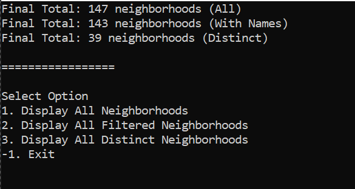

# LINQ in Manhattan

This program brings data from an external JOSN file, reads the data, and filter the data based on specified values.

## Run


## JSON in c# 

> JavaScript Object Notaion

### The power of JSON is we can convert objects to strings and vise versa.

## How to use JSON in c# ?

The ```Newtonsoft.Json.Linq``` namespace provides classes that are used to implement LINQ to JSON.

### Example

```json
{
    name:"HamZa",
    age:"21"
}
```

This JSON can be represented in c# like this 

```c#
class Person{
    public string Name {get; set;}
    public string Age {get; set;}
}
```
